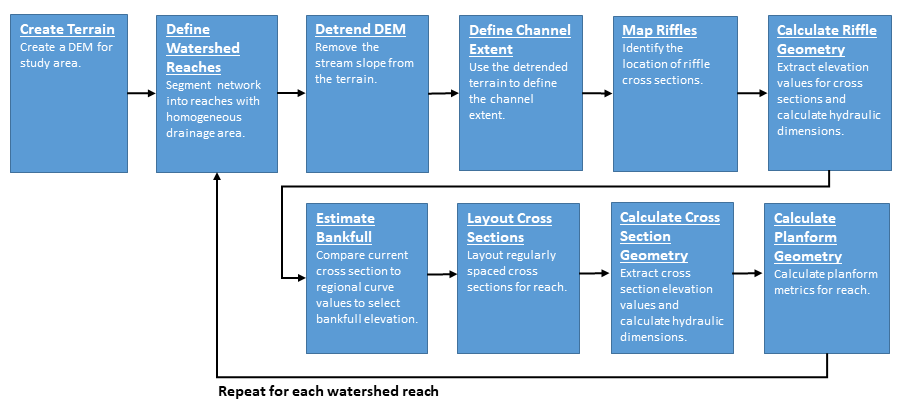

# Workflow
This chapter provides an overview of some of the workflows that can be used to perform a rapid watershed assessment using `FluvialGeomorph`. Through analyzing a wide range of project sites, we have created a standard analysis framework. This framework defines a series of standard analysis objects that are used in a regular process to perform different types of analysis. 


## Units of Analysis
To help organize the workflow process we have defined several units of analysis:

* **Project:** These are the primary work units and correspond to projects that customers have requested for analysis. Customers define specific goals for each project that determine the specific workflow chosen. These goals define a project study area for each project. These project study areas typically consist of a particular watershed, a mainstem section of a named river, or a discrete stream reach. 

* **Site:** Project areas are subdivided into "sites". Sites are typically named tributaries and their subwatersheds within the project study area.   

* **Reach:** Sites are further subdivided into "reaches". Reaches are defined according to project goals and use conventional rules for specifying reaches (i.e., tributary confluence to confluence), significant infrastructure, changes in surficial geology, etc.   

* **Year:** Since `FluvialGeomorph` analysis is based on LiDAR terrain surveys, the timing of the survey is a critical factor in the analysis. LiDAR is a single point-in-time dataset. Since LiDAR can be collected periodically, our data structure must accommodate multiple distinct time periods for which channel dimensions are extracted. If there are multiple LiDAR surveys available for the project study area, the most recent survey is referred to as the base year. 


## Analysis Levels
We have defined a standard workflow that is modular, allowing analysts to prescribe and customers to purchase progressively more detailed analysis as needed. The workflow is organized according to the following levels:

* **Level 1:** The purpose of Level 1 is to extract basic channel dimensions. 
* **Level 2:** The purpose of Level 2 is to extract bankfull channel dimensions. 
* **Level 3:** The purpose of Level 3 is to extract planform dimensions. 


## Geodatabases
The `FluvialGeomorph` workflow was designed around a standard set of objects organized into a standard set of geodatabases. 

* **Study Area Geodatabase:** This type of geodatabase stores feature classes (FC) that apply to the entire project study area or site. The workflow begins with developing FCs that define the project study area, Digital Elevation Models (DEM), derived stream network, etc. If there are multiple LiDAR surveys for the project study area, a separate study area geodatabase representing each survey is created beginning with the base year. 

* **Reach Geodatabase:** This type of geodatabases stores FCs that apply to a specific reach. The `FluvialGeomorph` tools create a standard set of FCs. Creating a separate geodatabase for each reach allows these standard FCs to be created for each "reach" unit of analysis. If there are multiple LiDAR surveys for the project study area, a separate reach geodatabase representing each survey is created beginning with the base year. 


## Derived Features
The definition of a common set of derived features is an important step in standardizing any workflow. The standard `FluvialGeomorph` database objects form a tightly linked set of features that work together in a particular order to accomplish the analysis. See the [FluvialGeomorph Tech Manual](https://techmanual.fluvialgeomorph.org) for a detailed description of each of these standard FCs. 


## Project File Structure
Establishing a standard storage structure for all project data is an important quality control step. A standard folder structure has the following benefits: 

* Clearly defined functional roles for each storage location reduces ambiguity and confusion. 
* Predictability reduces errors. 
* Standard structure allows analysts to move between projects more easily. 

The following folder structure is recommended to organize all project data:

```
Project_Name
└─── Sites
│    └─── 01_Site_Name
│    │    └─── Data
│    │    │        Reach1_year1.gdb
│    │    │        Reach1_year2.gdb
│    │    │        Reach2_year1.gdb
│    │    │        Reach2_year2.gdb
│    │    │        ...
│    │    └─── Elevation
│    │    │        year1.gdb
│    │    │        year2.gdb
│    │    │        ...
│    │    └─── Exports
│    │    └─── Maps
│    │    └─── Reports
│    └─── 02_Site_Name
│         ...
└─── Elevation
│    └─── Year1
│    │    year1.gdb
│    │    └─── LAS
│    └─── Year2
│         year2.gdb
│         └─── LAS
│         ...
└─── Exports
└─── Maps

```

* **Site Folders:** Site folders are used to store all of the files for each site. Each site in the project study area gets its own folder. Site folder order can be controlled by prefixing a number to each site name. 
* **Elevation Folders:** The elevation folders are used to store all of the data required to create a DEM for each LiDAR survey event. A LAS subfolder is used to hold all of the `.las` files for each LiDAR survey. Since these datasets can be massive, the idea is to separate these data into their own folder to improve data management. Once the terrain data are processed, only derived DEMs are then copied to the geodatabases in the Data folders. 
* **Site Data Folders:** The site data folders are used to store all of the site study area and reach geodatabases. 
* **Reports:** The Reports folders are used to store the reports created by tools for each reach. 
* **Maps:** The Maps folders are used to store map documents for a given project or site. 
* **Exports Folders:** The Exports folders are used to store static `.pdf` map documents exported from map projects for a given project or site. 


## Workflows
The `FluvialGeomorph` workflow has been organized using the following hierarchical grouping to help analysts better understand how to perform the analysis and what is being done during each step of the process. All workflow steps are sequential and build on the outputs of previous steps. 

* **Levels:** The top hierarchical grouping of the workflow. Levels are distinguished by the degree of fluvial geometric detail and metrics that will be derived. Levels 2 and 3 are optional.  

* **Stages:** The second hierarchical grouping of the workflow. Each level is subdivided into stages. Stages are mostly a conceptual grouping of steps to accomplish a specific objective in the analysis chain.  

* **Steps:** The third hierarchical grouping of the workflow. Stages are subdivided into steps. Steps typically involve running tools, manual editing, and quality assurance checks.  

* **Tools:** Tools are the lowest hierarchical grouping of the workflow. Tools perform operations that are suitable for automation.  


### Level 1 (L1) {#L1_summary}
The purpose of this level is to extract basic channel dimensions. This section will provide a brief overview of the Level 1 workflow. 

```{r echo=FALSE, out.width="100%", fig.cap="Level 1 Workflow Diagram"}

```

**Create Terrain:**
The purpose of this stage is to develop the terrain models for the project study area for all available LiDAR surveys. 

* Acquire Point Cloud - This step 
* Derive DEM
* Hydromodify DEM


**Define Stream Reaches:**
The purpose of this stage is to derive a synthetic stream network for the entire project study area and define their contributing watersheds. 

* Calculate Contributing Area
* Derive Stream Network
* Define Reaches
* delineate Watersheds

**Derive Flowline:**
The purpose of this stage is to derive a flowline, for each reach and survey event. 

* Derive Flowline
* Create Flowline Points

**Define Initial Floodplain and Channel Extent:**
The purpose of this stage is to define the initial floodplain and channel extent, for each reach and survey event. 

* Detrend DEM
* Estimate Initial Channel Extent
* Estimate Initial Floodplain Extent
* Calculate Channel Slope Raster

**Create Regular Cross Section Geometry:**
The purpose of this stage is to create regularly spaced cross sections and calculate dimensions, for each reach and survey event. 

* Create Regular Cross Sections
* Calculate Cross Section Watershed Area
* Calculate Cross Section River Position
* Calculate Cross Section Level 1 Dimensions

**Identify Features:**
The purpose of this stage is to identify salient features along each reach. 

* Create Features

**Run Report:**
The purpose of this stage is to run the Level 1 report for each reach. 

* Run Level 1 Report
* Perform QA


### Level 2 (L2) {#L2_summary}
The purpose of this level is to extract bankfull channel dimensions. 

**Create Initial Riffle Geometry:** 
The purpose of this stage is to identify and map riffle cross sections and roughly estimate an initial bankfull elevation for the base year for each reach. 

* Create Riffle Floodplain
* 

**Estimate Bankfull:**
The purpose of this stage is to estimate the detrended bankfull elevation for the base year for each reach. 

**Calculate Final L2 Cross Section Geometry:**
The purpose of this stage is to use the bankfull elevation determined in the last stage to calculate the final level 2 cross section dimensions for the base year for each reach. 

**Run Report:**
The purpose of this stage is to produce the Level 2 report for each reach. 


### Level 3 (L3) {#L3_summary}
The purpose of this level is to extract planform dimensions. 

**Define Valley Line:** 
The purpose of this stage is to define the valley trend line for the base year for each reach. 

**Define Meander Loops:** 
The purpose of this stage is to define meander loops and bends for the base year for each reach. 

**Calculate L3 Cross Section Geometry:**
The purpose of this stage is to calculate the Level 3 dimensions for each reach. 

**Run Report:**
The purpose of this stage is to run the Level 3 report for each reach. 


## Quality Assurance {#qa_tools}
This workflow contains a LOT of detailed steps! If everything isn't done just right, problems happen. So to help analysts stay on top of all of these details, we have adopted a layered approach to making sure everything gets done right. Here are the ways   

* **Task Tracking Spreadsheet:** To guide analysts through this workflow, we have developed a [task tracking spreadsheet]() to use to record progress through the analysis. This spreadsheet allows an analyst to record the completion of each of the steps outlined above, as well as key values used in the analysis. This spreadsheet can be stored in the site folder while data development progresses. Records in this spreadsheet can be periodically appended to a project or team level version to improve team communication on project progress. 

* **Check Tools:** The FluvialGeomorph toolbox contains the `Check` toolset that allows the analyst to perform checks on the standard FluvialGeomorph FCs for basic rule compliance. If analysts have questions about if a specific FC is causing problems, these check tools can be used. 

* **Tool Error Messages:** A series of low-level defensive programming checks have been implemented across all FluvialGeomorph functions and tools to help head-off problems. 

* **QA Checklist:** The [QA Checklist](#qa_checklist) helps analysts review the reports created using the tools to identify and fix problems in the underlying derived data. See the [QA Checklist](#qa_checklist) chapter in this manual for details. 
