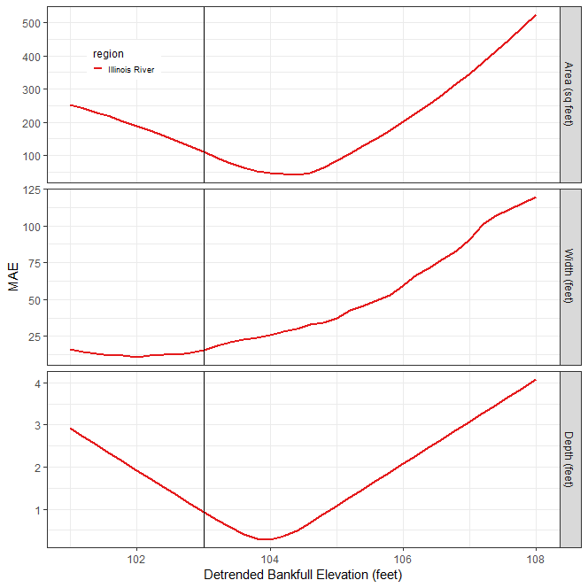

# Geoprocessing
This section describes the geoprocessing steps required to extract channel geometry dimensions from a LiDAR derived digital elevation model (DEM). 


## Create Terrain

### Develop Elevation Model
The purpose of this step is to develop a DEM for the study area. 

* Obtain an off-the-shelf DEM for the study area. 
* Determine if sufficient resolution exists in the channel. 
* If not, assemble LAS data for the channel. 
* Create LAS dataset of study area. 
* Set the LAS Dataset projection to the coordinate system UTM (select appropriate Zone based on location of the study area), Datum: NAD83. 
* Select LAS classes that contain non-vegetation points within the channel. 
* Use the `LAS Dataset to Raster` tool to export to raster. 
    * Z-Factor: 3.28084
    * Cell assignment Type: IDW
    * Void Fill Method: Natural Neighbor
    * Cell size: 1 foot (0.3048 meters)
* Create a `study_area` polygon feature class that delineates the extent of the study area. Use this feature class to clip the DEM to the desired study area. Edit this polygon to remove any elevation anomalies around the edges of the DEM. These anomalies are sometimes created by the `LAS Dataset to Raster` tool. 

### Elevation Model Hydro Modification
The purpose of this step is to create a hydro-modified DEM to ensure proper water flow across the study area. 

* Examine the stream channel through the study area and determine if there are any blockages to flow in the DEM. These blockages are typically built infrastructure such as road embankments where streams are conveyed through culverts or underground storm water structures. 
* If there are flow blockages in the study area, create a new line feature class named `cutlines` to store terrain modifications that remove flow blockages. This feature class must be in the same coordinate system as the DEM being modified. 
* In an edit session, identify human structures that block flow along the stream reach being studied. Draw a line beginning at the upstream side of the blockage to a point just downstream of the blockage. 
* Use the `02 - Burn Cutlines` tool to "burn" the `cutlines` features into the DEM. This tool creates the `dem_hydro` raster. 


## Define Watershed Reaches

### Define Stream Reaches
The purpose of this step is to create a synthetic flow network of streams for the study area. 

* Use the `03 - Contributing Area` tool to calculate the contributing area for the study area. If created, use the `dem_hydro` raster as input, otherwise use the original study area DEM. The `processes` parameter can be safely set to approximately 2 less than the number of cores on the computer running the tool. 
* Use the `04 - Stream Network` tool to create a synthetic stream network from the hydro-modified DEM. The `processes` parameter can be safely set to approximately 2 less than the number of cores on the computer running the tool. The `threshold` parameter should be set to a value of 200,000 to 500,000 depending on the study area. If the resulting `stream_network` is too dense (requiring a large amount of editing to remove extraneous tributaries), try rerunning the tool and increasing the `threshold` value. Conversely, if the resulting `stream_network` is too sparse (not enough of the stream network was delineated), try rerunning the tool and decreasing the `threshold` value. 
* Edit the resulting `stream_network` feature class to remove all tributary streams that do not constitute the network that will be analyzed in this study. 
* Edit the `stream_network` feature class to ensure that stream segments are represented by a single line and that there are no gaps in the steam network. 
* Use the `Field Calculator` tool to set the `Name` field to the name of the site being analyzed. Failure to complete this step will cause the next tool run to fail.
* Use the `05 - Create Flowline` tool to process the `stream_network` feature class that was just edited to produce a new `flowline` feature class. Use a smoothing tolerance from 5-20. The goal is produce a smooth flowline, but not remove too much resolution from the line (ensure the line remains in the channel and not cut into the floodplain). 
* Edit the `flowline` feature class to ensure that the flowline is digitized beginning with the downstream end and digitized upstream. In an edit session, select the flowline, choose to edit vertices, and ensure that the red endpoint is at the upstream end of the flowline. Use the flip command to ensure flowline is digitized in the correct direction.  


### Extract Stream Reach Profile Points
The purpose of this step is convert the flowline into a series of points along the stream. This tool takes the flowline feature class, converts it to a route, calculates the distance to the mouth of the river for all vertices, and creates a stream profile points feature class. The flowline feature class was created during the hydro modification process. 

* Use the `06 Stream Profile Points` tool to convert the `flowline` feature class into stream profile points. For this study, set the `km_to_mouth` parameter to 0 and the `station_distance` field to 1 meter. This tool will create a new feature class named `flowline_points`. 


## Detrend DEM


### Detrend Elevation Model
The purpose of this step is to produce a detrended DEM. A detrended DEM normalizes stream bank elevations for a given reach. 

* Use the `07 - Detrend` tool to create a detrended DEM for the study reach. For this study, set the `buffer_distance` field to 100 meters. 


## Define Initial Channel and Floodplain Extents

### Delineate the Initial Channel Extent
The purpose of this step is to use the detrended DEM to visually extract an initial channel extent polygon. The `detrend` DEM created in the last step can be used to iteratively explore different inundation extents derived from various water surface elevations. 

* Add the `detrend` feature class to the map Table of Contents. Name this layer `Channel Extent`. 
* On the Symbology tab of the `Channel Extent` layer, use the Classified renderer to classify the raster into 2 classes. Set the first class boundary to the detrended elevation that you would like to explore. Set the color of the first class (min value - detrended elevation) to blue and the color of the second class (detrended elevation - max value) to No Color. 
* Set the transparency of the `Channel Extent` layer to 50%. 
* Begin to delineate the channel extent by selecting a detrended elevation that inundates the channel up to at least the first terrace. The goal at this stage is to select a detrended elevation that captures the extent of the channel without "spilling" too much water into the floodplain. Once you discover which detrended elevation begins to allow water to access the floodplain, reduce the detrended elevation value slightly to keep the water in the channel. Try several detrended elevation values to help make the decision. 
* When you have chosen a detrended elevation, use the `08 - Water Surface Extent` tool to extract an initial channel extent area polygon. This tool creates a new polygon feature class named `banks_raw_xxx`, where xxx is the detrended elevation selected. 
* This feature class must be edited to select the channel area polygon(s). Open the attribute table for the `banks_raw_xxx` feature class and use advanced sorting to sort first by `gridcode` and then by `Shape_Area`. Polygons with `gridcode` = 1 are polygons inundated at the detrended elevation. Typically, the polygons with the largest area represent the channel. Begin selecting `gridcode` = 1 polygons with the largest area until the entire channel area is selected. 
* Export these selected features to a new feature class named `initial_channel_extent`. 
* Delete the `banks_raw_xxx` feature class created in this section.


### Create the Initial Channel Mask layer
The purpose of this step is to create a layer that defines an area just beyond the initial channel extent. 

* Add the `detrend` feature class to the map Table of Contents. Name this layer `Channel Mask`. 
* In the symbology of this layer, change the renderer from `stretched` to `classified`. Set the number of classes to 2. In the `classification` dialog, set the break value between the two classes to about one to two feet higher than the initial bankfull extent estimate. A couple of feet above the initial bankfull extent estimate should define the extent of the just the channel. For example, if the initial bankfull extent was estimated at 102 detrended feet, the initial bankfull height estimate would be 2 feet. One foot higher than the 2 foot initial bankfull height estimate would therefore be 103 detrended feet. 
* Set the transparency of the `Channel Mask` layer to 50%. 


### Create the Initial Floodplain Mask layer
The purpose of this step is to create a layer that defines the an initial estimate of the floodplain inundation extent. 

* Add the `detrend` feature class to the map Table of Contents. Name this layer `Floodplain Mask`. 
* In the symbology of this layer, change the renderer from `stretched` to `classified`. Set the number of classes to 2. In the `classification` dialog, set the break value between the two classes to four times the initial bankfull extent estimate. Four times the initial bankfull extent estimate should define the extent of the active floodplain. For example, if the initial bankfull extent was estimated at 102 detrended feet, the initial bankfull height estimate would be 2 feet. Four times the 2 foot initial bankfull height estimate would therefore be 108 detrended feet. 
* Set the transparency of the `Floodplain Mask` layer to 50%. 


### Create Channel Slope Raster
The purpose of this step is to create a channel slope raster that can be used in the visual identification of riffle locations in following step. 

* Use the `09 - Channel Slope` tool to calculate a raster of the channel slope. Use the `intitial_channel_extent` polygon created earlier to define the channel area within which the slope raster will be calculated. This tool creates a new feature class named `channel_slope`. 


## Map Riffles
The purpose of this step is to identify and map riffle locations. Riffles will be used in later steps to determine the bankfull elevation from gage stage discharge relationships. 


### Map Riffle Cross Sections
The purpose of this step is to identify the location of riffles in a stream reach.

Riffle locations are identified using the `channel_slope` raster calculated in the last step (and confirmed with high resolution aerial imagery). In the `channel_slope` raster, pools appear as relatively smooth areas of low slope due to the absence of LiDAR points (deep water absorbs laser pulses). Shallow water riffles appear as highly textured areas of relatively higher slope between pools due to the higher number of LiDAR points from the exposed bed material.

* Create a new line feature class named `riffle_floodplain` to store riffle cross sections. This feature class must be in the same coordinate system as the DEM. 

* Riffle locations should have the following characteristics: 
    * A straight reach between two meander bends, areas in the cross-overs between river bends
    * Clear indicators of the active floodplain or bankfull discharge
    * Presence of one or more terraces
    * Channel section and form typical of the stream
    * A reasonably clear view of of geomorphic features
    * Areas of high water surface slope 
    * Areas of minimum depth and width
    * Channel width parallel and consistent 
    * Avoid tributary influences

* Digitize riffle cross sections beginning with the left descending bank. In an edit session, use the flip command to ensure riffles are digitized in the correct direction. A red vertex denotes the end of a line segment. Therefore, the red end vertex should be on the right descending bank. 
* Check that each cross section is digitized in the correct direction (start at the left descending bank and end on the right descending bank) before going on to the next step. 
* Ensure that riffle cross sections are digitized to the full width of the active floodplain. Edit each `riffle_floodplain` feature to ensure that it extends at least to the edge of the `Floodplain Mask` layer, but no further. 
* This ensures that each `riffle_floodplain` feature covers the entire floodplain, but does not extend too far into the upland.  


### Assign Cross Section IDs
The purpose of this step is to ensure that riffle cross section identifiers are properly assigned. Assignment of cross section identifiers is critical for later tools to uniquely identify each cross section. 

* Add a long integer field named `Seq` to the `riffle_floodplain` feature class to hold the unique number of the cross section. This will be used to iterate through cross sections. 
* Assign integer values to the `Seq` field starting with one. Begin numbering at the downstream extent of the study area and moving upstream. 


## Calculate Riffle Geometry
The purpose of the next three steps is to calculate the geometry of the cross sections defined in the previous steps. 


### Calculate Cross Section Watershed Area
The purpose of this step is calculate the watershed area of each cross section. The watershed area draining to each cross section will be used in later steps to define several hydraulic geometry relationships. 

* Add the NHDPlus flow accumulation `NHDPlus_FAC` that has been clipped to the study region to an ArcMap document. Measure the distance from the flowline to each cross section to determine the snap distance required. 
* Use the `12 - XS Watershed Area` tool to calculate the watershed area for each cross section. 
* Complete this step for both the `riffle_channel` and `riffle_floodplain` feature classes. 


### Assign Cross Section River Position
The purpose of this step is to assign a river position to each cross section. The river position of each cross section will be used in later steps to calculate several channel parameters (i.e., gradient, sinuosity). 

* Use the `13 - XS Assign River Position` tool to calculate the distance to the mouth of the river for each cross section. 
* Complete this step for both the `riffle_channel` and `riffle_floodplain` feature classes. 


### Create the `riffle_channel` feature class
The purpose of this step is to trim the riffle cross sections in the `riffle_floodplain` feature class to match the extent of the `Channel Mask` layer. This allows a more detailed examination of the channel area. 

* In ArcCatalog, make a copy of the `riffle_floodplain` feature class and name it `riffle_channel`.
* Edit each `riffle_channel` feature to ensure that it extends at least to the edge of the `Channel Mask` layer, but no further. Use snapping to ensure that vertices of the `riffle_channel` features are coincident with the `riffle_floodplain` features. 
* This ensures that each `riffle_channel` feature covers the entire channel, but does not extend too far into the floodplain.


### Calculate Cross Section Station Points
The purpose of this step is convert the cross section line feature class into a point feature class representing cross section station points. This feature class will be used in later steps to calculate hydraulic geometry dimensions. 

* Use the `14 - XS Create Station Points` tool to calculate cross section station points for each cross section. For this study, set the `station_distance` parameter to 0.3048 meter (1 foot). This tool creates a new feature class named `riffle_points`. 
* Complete this step for both the `riffle_channel` and `riffle_floodplain` feature classes. 


### Check Cross Sections
The purpose of this step is to plot each cross section to ensure it was digitized correctly. 

* Use the `15 - XS Plot` tool to plot each riffle cross section. Use the detrended bankfull elevation value that you selected for the initial channel extent for the value of the `bankfull_elevation` for the purpose of this QA check. 
* After creating a plot of the first cross section, in the `R Graphics` window, turn on recording (`History|Recording`) to keep a record of the subsequent cross section plots created during this session. Use the keyboard's `Page Up` and `Page Down` keys to scroll through the plots. If you make a mistake, use the `History|Clear History` menu item to clear the previously recorded graphs. 
* Use the cross section profile plots to check that the digitized cross sections have the following characteristics:
    * Banks should be digitized to a high enough elevation sufficient to extend across the active floodplain. However, do not exceed this elevation as it will reduce the resolution of the geomorphic features within the the channel displayed on the graph. 
    * Left and right banks are digitized to a similar elevation. One bank should not be extremely higher that the other. 


## Estimate Bankfull
The purpose of this step is to produce the `Estimate Bankfull Report`. This report will be used to estimate the bankfull water surface elevation for the current reach. This report conducts a sensitivity analysis using the regional curve estimates of channel dimensions across a range of elevation values to identify the bankfull elevation value that best fits the regional curve estimate. 

* Use the `19 Estimate Bankfull` tool to produce the `Estimate Bankfull Report`. 
    * `xs_points_fc`: Riffle cross section points: `riffle_points`
    * `regions`: Select the regional curve that will be used to estimate the bankfull water surface elevation. 
    * `from_elevation`: The lowest detrended elevation value that defines the lower end of the range to be used for the sensitivity analysis.
    * `to_elevation`: The highest detrended elevation value that defines the upper end of the range to be used for the sensitivity analysis.
    * `by_elevation`: The value to increment the sequence by between `from_elevation` and `to_elevation`. These three values define the sequence used to create the sensitivity analysis. 
    * `bankfull_estimate`: The detrended elevation value that defines the bankfull water surface elevation. 
    * `output_dir`: The folder where the `Estimate Bankfull Report` will be saved. 
    * `output_format`: The file format of the report. 
* The `19 Estimate Bankfull` tool is intended to be run iteratively, testing the fit of a range of detrended bankfull elevations. Use the Bankfull Elevation Goodness of Fit graph in the report to determine the detrended bankfull elevation that minimizes error. Choose the detrended bankfull elevation that minimizes error on subsequent runs of the report. 
* From the initial `Estimate Bankfull Report`, select the detrended bankfull elevation that minimizes error on the Bankfull Elevation Goodness of Fit graph and rerun the report using that value. 
* In the example figure below, the detrended bankfull elevation of 104 ft. minimizes error (y-axis Mean Average Error) for both area and depth. Although 102 ft. appears to be the detrended elevation that minimizes error for width, 104 ft. does a better job for area and depth. Therefore, using the logic of "best two out three", a detrended bankfull elevation of 104 ft. should be chosen for this reach and will be used for later steps in this analysis.

```{r echo=FALSE, out.width="100%", fig.cap="Bankfull Elevation Goodness of Fit"}

```


## Identify Infrastructure
The purpose of this step is to identify infrastructure that impacts stream structure and function throughout the reach. These infrastructure features will be used to indicate the position of infrastructure in several maps and graphs. 

* Create a new point feature class named `features`. The feature class should contain the following fields:
    * `Name` - Text (50), Used to record the name of the infrastructure. 
    * `km_to_mouth` - double, Used to record the longitudinal position along the reach. 
* Working upstream from the downstream end of the reach, examine the DEM and aerial imagery for infrastructure that could potentially impact stream structure and function. 
* Add the `flowline_points` feature class to the map document. 
* Start an edit session on the `features` feature class. 
* When impacting infrastructure is found, create a point feature centered on the `flowline` feature class. 
* Assign it a descriptive label in the `Name` field, and record its longitudinal position along the reach (see next bullet) in the `km_to_mouth` field. 
* To determine an infrastructure feature's longitudinal position along the reach, use the identify tool to find the closest point in the `flowline_points` feature class and use its `POINT_M` value. 
* Repeat these steps to record all of the infrastructure points along a reach. 


## Define Valley Line
The purpose of this step is to define a line that represents the trend of the valley for the stream reach. 

### Define Flood Prone Extent
The purpose of this step is to define a flood prone extent for the reach.

* From the `Bankfull Estimate` report created in the last step, identify the detrended bankfull elevation. In the example above, this value was 104 ft. 
* Determine the bankfull depth. The detrending process expresses stream elevations using a base index value of 100. Therefore an estimate of detrended bankfull elevation of 104 ft. means that at bankfull discharge, the water surface elevation is 4 ft. above the detrended stream base index value of 100 ft. for this reach. This value is similar to the bankfull depth (with caveats). 
* Determine flood prone height. Flood prone has been determined through empirical studies to be approximately two times the bankfull depth. Using the bankfull depth calculated in the last step, calculate the flood prone depth (8 ft.). Therefore, the flood prone detrended elevation would be 108 ft. 
* With the detrended flood prone elevation for your reach determined in the last step, use the `08 - Water Surface Extent` tool to extract a flood prone area polygon. This tool creates a new polygon feature class named `banks_raw_xxx`, where xxx is the detrended elevation selected. 
* This feature class must be edited to select the flood prone area polygon(s). Open the attribute table for the `banks_raw_xxx` feature class and use advanced sorting to sort first by `gridcode` and then by `Shape_Area`. Polygons with `gridcode` = 1 are polygons inundated at the detrended elevation. Typically, the polygons with the largest area represent the channel. Begin selecting `gridcode` = 1 polygons with the largest area until the entire flood prone area is selected. 
* Export these selected features to a new feature class named `flood_prone`. 
* Delete the `banks_raw_xxx` feature class created in this section. 

### Create Candidate Valley Lines
The purpose of this step is to create a set of candidate valley lines created by smoothing the flowline. Several smoothed valley lines will be created in this section. This set of valley lines will be selected from in the next section. 

* Use the ESRI `Smooth Line` tool to smooth the `flowline` feature class. Use the `PAEK` smoothing algorithm. Use a `Smoothing Tolarance` value of 200 meters. Name the output feature class `valleyline_200`
* Repeat the previous step using the `Smoothing Tolerance` values of 250, 300, 350, 400, 450, and 500. 

### Select the Valley Line
The purpose of this step is to select from the set of valley line feature classes created above the valley line that is most smoothed but still fits (mostly) within the `flood_prone` polygon extent.

* Add the `flood_prone` polygon and all of the valley line feature classes to a map document.
* Identify the valley line feature class that has the highest smoothing tolerance value that also is mostly contained within the extent of the `flood_prone` polygon. 
* Rename the selected valley line to `valleyline`. 


## Define Meander Loops
The purpose of this step is to delineate the meander loops and bends for the stream reach. 

### Create a Bankfull Polygon
The purpose of this step is to create is the extract a bankfull extent polygon. 

* From the `Estimate Bankfull Estimate` report created previously, identify the detrended bankfull elevation. In the example above, this value was 104 ft. 
* With the detrended elevation for your reach determined, use the `08 - Water Surface Extent` tool to extract a bankfull area polygon. This tool creates a new polygon feature class named `banks_raw_xxx`, where xxx is the detrended elevation selected. 
* This feature class must be edited to select the bankfull area polygon(s). Open the attribute table for the `banks_raw_xxx` feature class and use advanced sorting to sort first by `gridcode` and then by `Shape_Area`. Polygons with `gridcode` = 1 are polygons inundated at the detrended elevation. Typically, the polygons with the largest area represent the channel. Begin selecting `gridcode` = 1 polygons with the largest area until the entire bankfull area is selected. 
* Export these selected features to a new feature class named `bankfull_area`. 
* Delete the `banks_raw_xxx` feature class created in this section. 


### Create the `banklines` feature class
The purpose of this step is to create a banklines feature class that represents the banklines at the bankfull elevation. The `banklines` feature class will have two records, one representing the left descending bankline and another the right descending bankline for the stream reach. 

* Use the `Polygon To Line` tool to convert the `bankfull_area` polygon feature class created in a previous step into a line feature class named `banklines`. 
* Add a new text field to the `banklines` feature class named `ReachName`.  
* Add a new long integer field to the `banklines` feature class named `bank_id`. 
* Add a new text field to the `banklines` feature class named `bank`. The purpose of this field is to designate which bank is the right descending bank and which is the left descending bank. 
* Start a new edit session on the `banklines` feature class.
* Use the `Explode Multipart Feature` on the advanced editing toolbar to explode the multipart line feature for the `bankline` feature class. 
* Add the `flowline` feature class to the map document. 
* Use the `Split Tool` to split the line features at the end of the flowline. The banklines should not extend past the end of the flowline.
* Use the 'Split Tool' to trim any tributaries from the 'banklines' feature class.
* The goal of this step is to have only two features, one representing the left descending bankline and another the right descending bankline. Delete all other line features. 
* Ensure that the banklines are digitized in the upstream direction. Edit the `banklines` feature class to ensure that each bankline is digitized beginning with the downstream end and digitized upstream. In an edit session, select the flowline, choose to edit vertices, and ensure that the red endpoint is at the upstream end of each bankline. Use the flip command to ensure each bankline is digitized in the correct direction. 
* Check that each bankline is digitized in the upstream direction (red endpoint at the upstream end) before going on to the next step. 
* In the `ReachName` field enter the reach name. 
* In the `bank` field, enter the string `right descending` or `left descending` to designate which bank each line represents. 
* In the `bank_id` field enter a `1` for the `right descending` bank and `2` for the `left descending` bank. 

### Create the `loop_points` feature class
The purpose of this step is to create a point feature class to delineate the start, end, and apex of each meander loop and bend. 

* Create a new point feature class named `loop_points`. Enable z and m values. The feature class should contain the following fields:
    * `loop` - long integer
    * `bend` - long integer
    * `position` - text (10)
    * `ReachName` -  text (50)

<insert loop and bend diagram here>

* Begin numbering loops and bends starting at the downstream end of the reach and increase numbering upstream. 
* The beginning and end of loops are delineated when the `valleyline` *definitively* crosses the `flowline`. 
* If the `flowline` crosses the `valleyline` and then crosses back over in a short distance, this is not considered a definitive crossing. A definitive crossing is one where the `flowline` approaches the `valleyline`, crosses it, and then continues to move away from it for a long distance. 

<insert diagrams of definitive crossings and un-definitive crossings>

<insert diagram of a loop with multiple bends>


### Create the `bankline_points` feature class
The purpose of this step is to convert the `banklines` feature class into a set of bankline points that hold loop and bend information from the `loop_points` feature class. 

* Use the `14b - Bankline Points` tool to assign loops, bends, elevations and valley line positions to bankline points. 
* When the tool completes, check that this tools runs correctly by ensuring that the `loop`, `bend`, `position`, `valley_POINT_X`, `valley_POINT_Y`, and `valley_POINT_M` fields are populated. Only bankline point features within loops and bends will have values in the `loop`, `bend`, and `position` fields. However, all records should have values in the `valley_POINT_X`, `valley_POINT_Y`, and `valley_POINT_M` fields. 
* Apply the following definition query to the `bankline_points` feature class: "loop IS NOT NULL". 
* Only `bankline_points` features between `loop_points` features should be visible. 

### Assign Loops and Bends to Cross Sections
The purpose of this step is to assign the loops and bends defined in the last step to the riffle cross section feature classes. 

* Use the `14c - Assign Loops` tool to assign loops and bends to cross sections. 
* Check that the `loop` and `bend` fields are assigned the appropriate loop and bend. 
* Complete this step for both the `riffle_channel` and `riffle_floodplain` feature classes. 


## Calculate Cross Section Geometry
The purpose of this step is to calculate cross section dimensions. All of the previous steps were required to prepare input datasets necessary to calculate cross section dimensions. 

* Use the `15 - XS Dimensions` tool to calculate channel geometry variables. 
* Use the `15b - XS Planform` tool to calculate reach planform variables. 


# New Section 12


