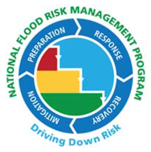

# FluvialGeomorph User Manual
The user manual for the FluvialGeomorph project. 

## Project Status

## Description
This user manual describes how to use FluvialGeomorph for stream analysis. 

## Funding
Funding for development and maintenance of FluvialGeomorph has been provided by the following US Army Corps of Engineers (USACE) programs:

* [Ecosystem Management and Restoration Research Program (EMRRP)](https://emrrp.el.erdc.dren.mil).
* [Regional Sediment Management Program (RSM)](https://rsm.usace.army.mil/)
* [Mississippi River Geomorphology and Potamology Program (MRG&P)](https://www.mvd.usace.army.mil/Missions/Mississippi-River-Science-Technology/MS-River-Geomorphology-Potamology/)
* [Flood Risk Management Program (FRM)](https://www.iwr.usace.army.mil/Missions/Flood-Risk-Management/Flood-Risk-Management-Program/)

## Authors
* [Michael Dougherty](mailto:Michael.P.Dougherty@usace.army.mil), Geographer, Rock Island District, U.S. Army Corps of Engineers
* [Christopher Haring](mailto:Christopher.P.Haring@usace.army.mil), Fluvial Geomorphologist/Research Physical Scientist, Coastal Hydraulics Laboratory, U.S. Army Corps of Engineers
* [Davi Michl](mailto:Davi.E.Michl@usace.army.mil), Biologist, US Army Corps of Engineers, Rock Island District

## Read the Report
Read the report here: [FG-User-Manual](https://master.d3ovjsy7p31fyx.amplifyapp.com/index.html)
